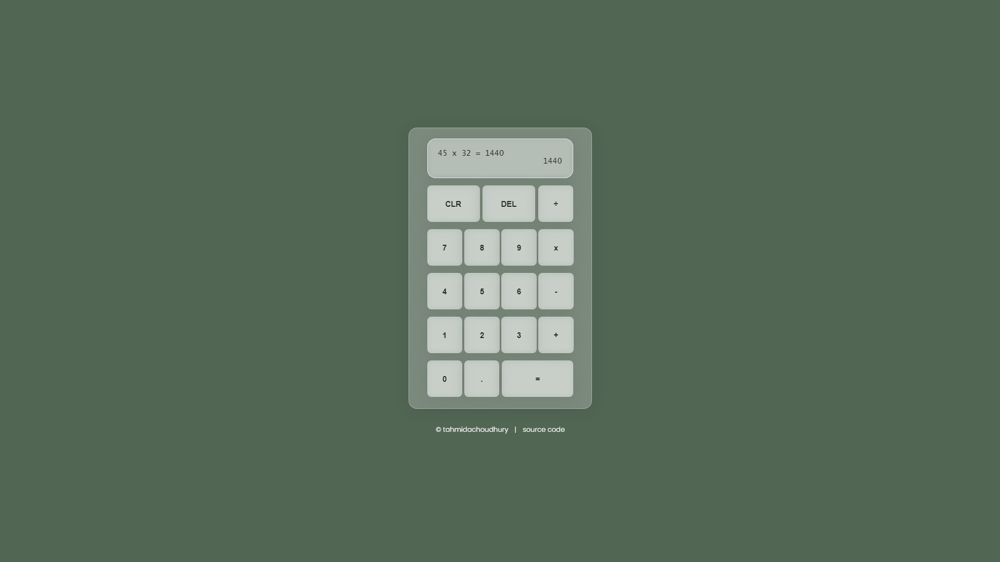
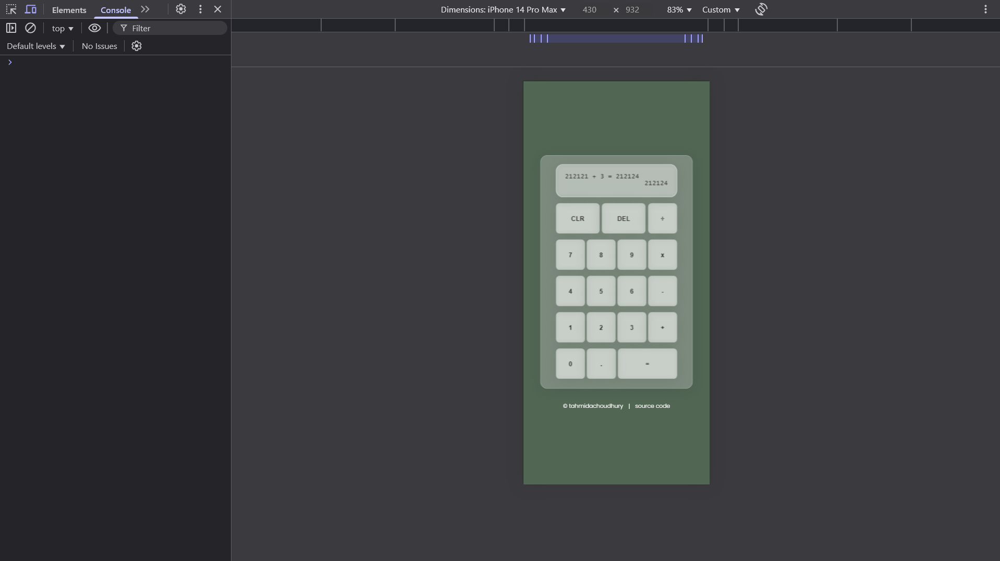
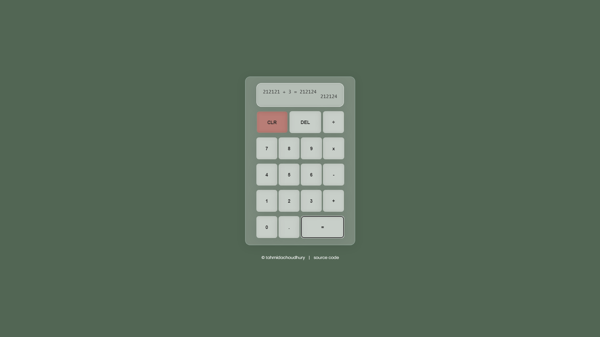
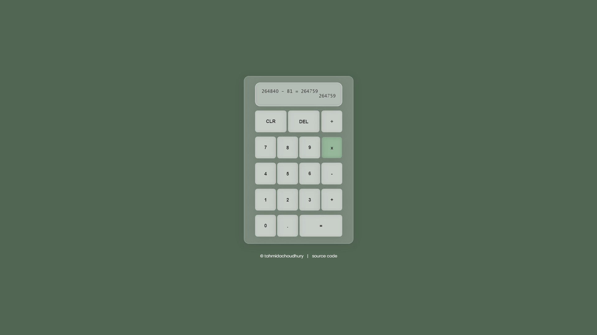
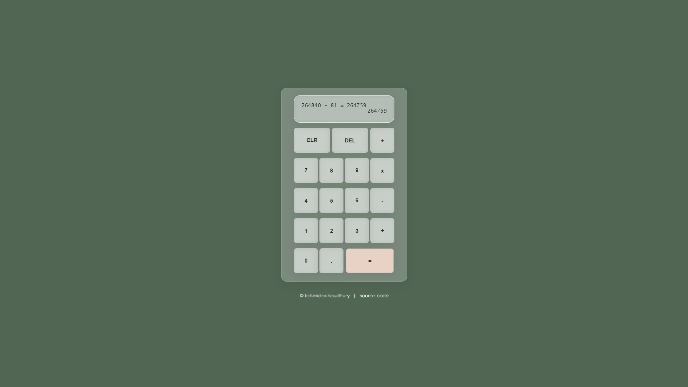
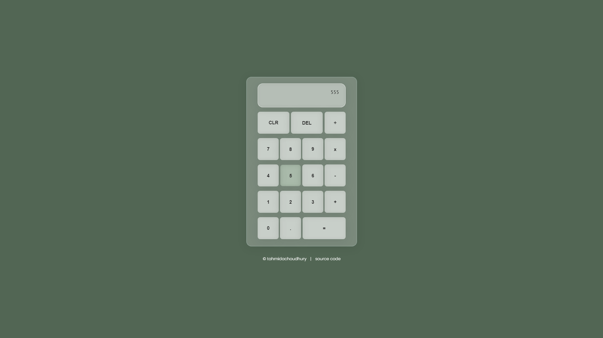

# JavaScript Web Calculator

[](https://github.com/tahmidachoudhury/calculator)

---

## Table of Contents

- [Overview](#overview)
- [Features](#features)
- [Screenshots](#screenshots)
- [Contact](#contact)

---

## Overview

A simple web calculator with the logic built using JavaScript fundementals. I built this as the final project in The Odin Project's foundations curriculum.

---

## Features

- **Feature 1:** Responsive design.

- **Feature 2:** Button highlights for better UX

---

## Installation

Follow these steps to get your development environment set up:

1. **Clone the repository:**
   ```bash
   git clone https://github.com/tahmidachoudhury/calculator
   cd calculator
   ```

---

## Screenshots

Below are some screenshots that provide a visual overview of the project:

### Main Interface


_The main screen. I can not take credit for the design as I saw an example project and really liked the clean, simple look. This is the only page of the site and here is where you can interact with all the different features._

### Feature 1: Responsive Design


_After learning more about CSS, I returned to this project and used media queries to make the calculator responsive to different display sizes_

### Feature 2: Button highlights






_Instead of keeping all buttons the same colour, I found other apps dynamically changing colour when interacted with. After implementing, it really improved the feel of the calculator and made it a lot easier on the eyes._

---

## Contact

If you have any questions, suggestions, or feedback, feel free to reach out!

- **Email:** [tahmidachoudhury@outlook.com](mailto:tahmidachoudhury@outlook.com)
- **LinkedIn:** [Tahmid Choudhury](https://www.linkedin.com/in/tahmid-choudhury-a1a05a252)
